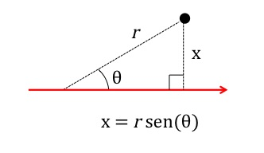

```{r setup, include=FALSE}
library(learnr)
knitr::opts_chunk$set(echo = FALSE, warning = F, message = F)
```

## Data background

In this practical we will reanalise the data used in Corlatti, Fattorini and Nelli (2014). The paper compares three different census techniques (block counts, distance sampling and capture-mark recapture) to estimate the density of male Alpine chamois (*Rupicapra rupicapra*) in an area of the Gran Paradiso National Park (Italy). In this exercise we will concentrate only on the linear transect data used for distance sampling (data kindly provided by the authors). In the paper the linear transect data was analysed using the windows based program DISTANCE 6.0. Here we will see instead how to performe the same analysis within R using the `Distance` package by Miller et al. (2016). 

The data file provided by the authors is called `distance_chamois.csv` and you can  [download here](www/distance_chamois.csv). We will start by reading it into an R dataframe using the `read.csv` function:

```{r load_data, echo=T, eval=F}
chamois.dat<-read.csv("distance_chamois.csv")
```

## File preparation and formatting

Commonly distance sampling data is collected in the field as the linear distance from the observed animals and the angle formed by the intersection of the linear transect and the imaginary line between the observer and the animal.

The perpendicular distances (*x*), needed to estimate the Detection function, can then easily be obtained with basic trigonometry, knowing the angle $\theta$ and the distance from the observer *r* 



Alpine chamois, however, live in the mountains, and are therefore not always on the same horizontal plane as the observer, making the calculation of the perpendicular distance slightly more complicated. In the data file provided Corlatti et al. (2014), the angle is actually the vertical angle, when the observer is positioned perpendicular to the animal in respect to the transect. Therefore,having the distance *r* and the angle $\theta$, in this case we are estimating the side of the triangle opposite the hypothenuse *r* (called the adjacent *a*) rather than the opposite *x*, which is obtained using the cosinus rather than the sinus of angle  $\theta$: 
  
$$a = r\cos(\theta) $$

Trigonometric functions take radians as input and not degrees, therefore first we have to transform our angle measurements (currently in degrees) into radians. As 180 degrees = $\pi$ radians, we can easily transform all the data in the 'angle' variable as follows:

```{r radians, echo=T, eval=F}
chamois.dat$angle <- chamois.dat$angle*(pi/180)
```

And now we can get the perpendicular distances (which we call 'distance' in the dataframe) using the trigonometric formula described above (in the dataframe *r* = obs.distance):

```{r perp_distance, echo=T, eval=F}
chamois.dat$distance <- chamois.dat$obs.distance*cos(chamois.dat$angle)
```

`Distance` needs the data in a file with a specific format (Search the help for the "flatfile" data format for more information). Specifically, each row of the data table corresponds to one observation and must have the following columns:

`distance`	    prependicular distance to object
`Sample.Label`	Identifier for the sample (transect id)
`Effort`	      effort for the transect (e.g. line transect length or number of times point transect was visited)
`Region.Label`	label for a given stratum
`Area`	        area of the strata
`size`          cluster size

We have thus to rename the relevant column names as specified above (we can leave the other ones as they are):

```{r rename, echo=T, eval=F}
names(chamois.dat)<-c("Date","Sample.Label","replicate","angle",
                      "obs.distance","size","Effort","distance")
```

As we have 8 replicated visits to the same transects, we have to adjust the Effort (e.g. the length of the transects) accordingly multipling it by 8 (the number of visits), otherwise we will get biased results:   

```{r effort, echo=T, eval=F}
chamois.dat$Effort <-chamois.dat$Effort*8
```

We also need to add a Region.Label. In this case we have only one stratum, so we will just call it 'GPNP' (Gran Paradiso National Park).
```{r region_label, echo=T, eval=F}
chamois.dat$Region.Label<-"GPNP"
```

Finally, we have to specify the Area size, which, for this study is 10.8 $Km^2$
```{r area_size, echo=T, eval=F}
chamois.dat$Area <-10.8
```

We have now everything we need to perform our Distance sampling analysis

## Estimating the detection function

If you have not done so before, it is now time to install the package `Distance` (Miller et al. 2014):

```{r install_distance, echo=T, eval=F}
install.packages("Distance") 
```

You need to perform this only once on your machine. 

To use the functions inside the Distance package, you will have first to call its library within each session:

```{r call_library,echo=T, eval=F}
library(Distance)
```

```{r data-load}
library(Distance)
chamois.dat<-read.csv("https://raw.githubusercontent.com/achazhardenberg/EcoStats/master/inst/Tutorials/Distance_Sampling/www/distance_chamois.csv")
chamois.dat$angle <- chamois.dat$angle*(pi/180)
chamois.dat$distance <- chamois.dat$obs.distance*cos(chamois.dat$angle)
names(chamois.dat)<-c("Date","Sample.Label","replicate","angle",
                      "obs.distance","size","Effort","distance")
chamois.dat$Effort <-chamois.dat$Effort*8
chamois.dat$Region.Label<-"GPNP"
chamois.dat$Area <-10.8
chamois_hn<-ds(chamois.dat, convert.units = 0.001)
chamois_hr<-ds(chamois.dat, key="hr",convert.units = 0.001)
```
  
Let's now start by trying to fit a 'half-normal' key function using the `ds` function. The 'half-normal' key function, is the default one, so we do not need to specify it in the arguments.
We also add the convert.units argument, because transect length (Effort) is expressed in $Km$ while the distances are in meters. Applying a unit conversion of 0.001, we convert the distances to the same unit as the transect length, and  our density estimates will correctly be expressed as nr. chamois/$Km^2$.

```{r half_normal, echo=T, eval=F}
chamois_hn<-ds(chamois.dat, convert.units = 0.001)
```


The function `ds` automatically fits the choosen detection function with various adjustment terms and selects the best one following the Aikaike Information Criterion (AIC). AIC is a model selection criterion which, in a nutshell, provides a relative measure of how much information is contained in one model compared to an other one. The model with the smallest AIC (relative to other models) is the one which represents a better fit to the data. In this case, the half-normal key function, with cosine (2) adjustments appears to provide the best fit to the data compared to the other half-normal models, having the smallest AIC (2161.92 vs. 2163.178 of the next "best fitting" model).

We can give a look to the resulting detection function graphically using `plot`:

```{r glimpse, exercise=TRUE, exercise.setup = "data-load"}


```

The detection function looks reasonable, and we can check this  applying also a formal Goodness of Fit test. `Distance` offers three different tests (Chi-square, Kolmogorov-Smirnov and Cramer-von Mises test) through the `ddf.gof` function which we can call on the 'ddf' object within the model object (in this case chamois_hn). By default, also a Q-Q plot is generated: Basically, if all the points are nicely on the line in the qq plot and the tests result beeing **not significant**, it means that the distance data do not deviate significantly from the expected detection function, and therefore we can say that we have a reasonably good fit of the data and the detection model.   

```{r gof, exercise=TRUE, exercise.setup = "data-load"}
ddf.gof(chamois_hn$ddf)


```
  
Let's try also a "Hazard-Rate" key function: 

```{r hazard_rate, echo=T, eval=F}
chamois_hr<-ds(chamois.dat, key="hr",convert.units = 0.001)
```

And let's look at the resulting Detection function also for this model: 

```{r glimpse2, exercise=TRUE, exercise.setup = "data-load"}


```

Compare this plot with the detection function obtanied with the 'Half-normal' key. What differences do you notice?

So, which key function should we finally choose to estimate the density and abundance of chamois? Again we can use AIC, and thus select the best possible combination of key function and adjustment terms, using the `summarize_ds_models` function:

```{r kable_table, exercise=TRUE, exercise.setup = "data-load"}
summarize_ds_models(chamois_hn,chamois_hr, output = "plain")


```

Delta AIC represents the difference in AIC from the model with the lowest AIC (best fitting model), which in this case is the one with a hazard-rate key function without adjustements and which we will thus use to estimate the abundance and density.

## Estimating the Density and Abundance

The estimation of the Density and the Abundance is obtained with `Distance` simply calling the summary of the selected model object (In this case the Hazard-rate model without adjustments provided by chamois_hr):

```{r  summary,exercise=TRUE, exercise.setup = "data-load"}


```

## Literature cited

Corlatti, L., Fattorini, L., & Nelli, L. (2015). The use of block counts, mark-resight and distance sampling to estimate population size of a mountain-dwelling ungulate. *Population Ecology*, 57(2), 409-419.

Miller, D. L., Rexstad, E., Thomas, L., Marshall, L., & Laake, J. (2016). Distance Sampling in R. *bioRxiv*, 063891.


 
